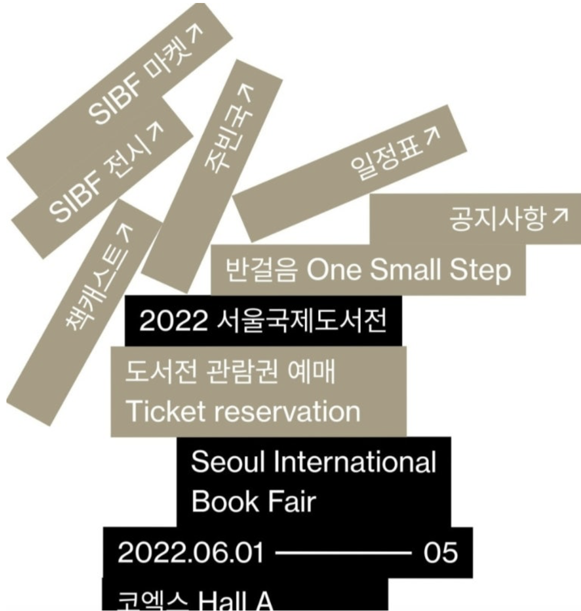

# Final Project Proposal: Interactive Modern Art Library

## Outline of Changes and Additions
For the Final Project, I plan to extend the "Modern Art Guide" Midterm Project into a highly interactive, completed web experience. The site will evolve into a virtual "Library of Modern Art" with enhanced UI/UX and new content.

### 1. New Content: Art Movements
I will expand the timeline past Dada by adding the following art movements up to the contemporary era, such as Surrealism, Pop Art, and architectures.

### 2. Custom JavaScript & External Framework
To make the site interactive and fulfill the custom JavaScript requirement:
- **Draggable Library Books:** On the homepage, each art movement will be represented as a book object. The user can drag, move, and interact with the books.
   
- **Stack Gallery View:** Create a stack gallery view to showcase artworks in an interactive, layered format.
   
- **GSAP / Interact.js:** I will implement an external JavaScript framework (like GreenSock/GSAP or Interact.js) to power the drag-and-drop physics and the 3D book-opening animations. (I searched and these framework showed up, but didn't dig into details yet.)
- **Search and Filter:** I will build custom JavaScript functionality on the Artworks/Gallery page to allow users to search by artist or artwork name, and filter the gallery by art movement.

### 3. Bootstrap Integration
Since I already used custom CSS to build the components that Bootstrap provides, I consider this as the least priority. If it is necessary to use Bootstrap, I will apply Navbar and Modal(showing zoomed in image of artwork when clicked). 

### 4. Site Completion
- I will complete the site so no missing links or pages exists!