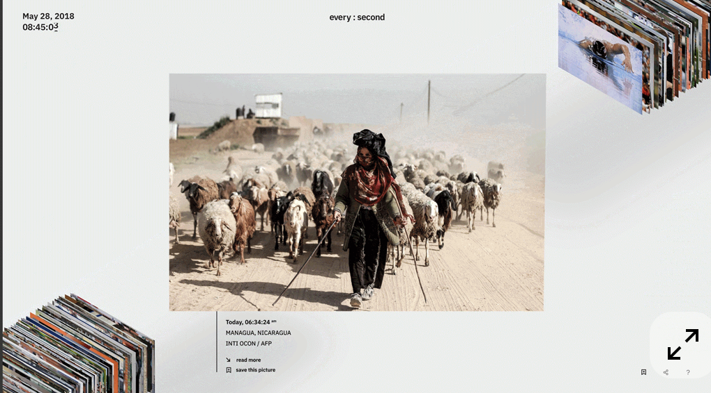

# Midterm Project Proposal

## Concept/Theme of the site
Learn and explore Modern Art
→ based on the CAS course I’m currently taking

### What I want to convey
* compare movements
* get to know important artworks related to that movement
* understand the shift between movements
* guide to visit art museums in NYC and see the artworks

### What I want/need to implement
* need to display images
* use links 
* creative navigation between different movement & artworks
* comparing different artists’ , movements’ artworks is important

## An existing website you drew inspiration from
[Pinterest collection](https://pin.it/VL7v5UgZl)
* these websites show the layout I want to implement for the landing page which shows different movements. (however they changed their website design or removed the page, so I cannot view the original website now)
 

 
* these websites show the layout that will show when i click on a movement.
 

 
* more references for the layout of each movement page is in the pinterest board

## Concepts/skills we have covered that you will use to build your site
* HTML Elements (nav bar, img tag, button tag, etc.)
* CSS & Box Model
* CSS Positioning
* CSS Flexbox
* CSS Grid

## Concepts/skills you need to still learn to complete the project
* Advanced CSS Layouts
* Responsive Web Design
* CSS Animations
* JavaScript Basics to implement interactive features... how can i make the content to be draggable?, filter the artwoks between different pages?

## Wireframe/sitemap
* [Sitemap](./sitemap.pdf)
* [Wireframe](./wireframe.pdf)
